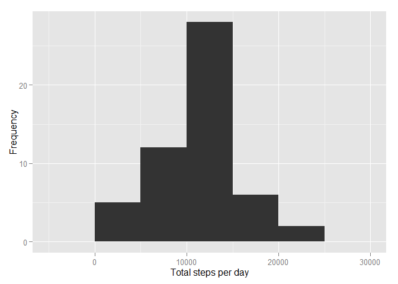

# Reproducible Research: Peer Assessment 1


*Loading and preprocessing the data:*  

1.Load libraries  
2.Set working directory  
3.Download data from url "http://d396qusza40orc.cloudfront.net/repdata%2Fdata%2Factivity.zip" and save it into file.zip  
4.Unzip file.zip  
5.read activity.csv data in with read.csv and store in data frame "data".


```r
library(Hmisc)
```

```
## Loading required package: grid
## Loading required package: lattice
## Loading required package: survival
## Loading required package: splines
## Loading required package: Formula
## 
## Attaching package: 'Hmisc'
## 
## The following objects are masked from 'package:base':
## 
##     format.pval, round.POSIXt, trunc.POSIXt, units
```

```r
library(ggplot2)

setwd("~/Coursera DS/Research/Peer1")
file<-"~/Coursera DS/Research/Peer1/file.zip"
if(!file.exists('activity.csv')){download.file("http://d396qusza40orc.cloudfront.net/repdata%2Fdata%2Factivity.zip",file)
unzip(file)}
data<- read.csv("activity.csv")
```


*What is mean total number of steps taken per day:*  
  
1. Histogram of total number of steps taken each day.  


```r
stepsByDay <- aggregate(steps ~ date, data, sum)

qplot(stepsByDay$steps, xlab='Total steps per day', ylab='Frequency',binwidth=5000)
```

 
  
2. Mean total steps taken per day and Median total steps taken per day:
  

```r
mean_Steps <- mean(stepsByDay$steps)
median_Steps <- median(stepsByDay$steps)
```
  
Mean:1.0766189\times 10^{4}  
Median:10765


*Average daily activity pattern:*  
  
1. Calculate mean steps per interval.  
2. Make time seris plot of mean steps per interval.  


```r
aveStepsInterv <- aggregate(steps ~ interval, data, mean)

ggplot(data=aveStepsInterv, aes(x=interval, y=steps)) +
  geom_line() +
  xlab("interval:5 Minutes") +
  ylab("Ave number of steps") 
```

 

3.Find Maximum ave steps per interval.  
4.Find interval with maximum ave steps per interval.
  

```r
aveStepsInterv <- aggregate(steps ~ interval, data, mean)

steps_max <- which.max(aveStepsInterv$steps)

interval_max <- aveStepsInterv[steps_max,"interval"]
```
  
Max Interval:835


*Imputing missing values*  
1) Create vector of missing values from steps column, since steps column is the only column with missing values.  Next find length of vector to get total number of missing values.    
  

```r
missing_steps<-which(is.na(data$steps))
total_missing <- length(missing_steps)
```
  
Total Missing:2304  
  
2) Create new dataframe which replaces missing values in steps column with median of steps column.  
  

```r
data_imputed <- data
data_imputed$steps <- impute(data$steps, fun=median)
```
  
3) Get subtotals of steps by date, and create histogram of total number of steps by day.  
  

```r
stepsByDay <- aggregate(steps ~ date, data_imputed, sum)

qplot(stepsByDay$steps, xlab='Total steps per day', ylab='Frequency',binwidth=5000)
```

 
  
4) Calculate the mean and median total number of steps for the imputed dataframe.  
  

```r
mean_Steps <- mean(stepsByDay$steps)
median_Steps <- median(stepsByDay$steps)
```
  
Mean:9354.2295082
Median:1.0395\times 10^{4}

The new mean and median from the imputed data are both lower than the original values.  Imputing the missing data appears to have skewed the data towards the earlier dates, and lowered the average steps taken per inteval.  


*Differences in activity patterns between weekdays and weekends:*  
  
1.) Added day factor column to imputed data to label weekday or weekend.  
2.) Calculated mean number of steps by interval and factor.  
3.) Plotted mean number of steps by interval for factors.  
  

```r
data_imputed$day = as.factor(ifelse(weekdays(as.Date(data_imputed$date)) %in% c("Monday", "Tuesday", "Wednesday", "Thursday", 
                                                                                "Friday"), "Weekday", "Weekend"))
mean_imputed_data <- aggregate(steps ~ interval + day, data_imputed, mean)

ggplot(mean_imputed_data, aes(interval, steps)) + 
  geom_line() + 
  facet_grid(day ~ .) +
  xlab("interval:5 Minute") + 
  ylab("Mean number of steps")
```

 
  
There is a higher maximum mean number of steps durring the week, but higher mean number of steps per interval through out the weekend.
  

